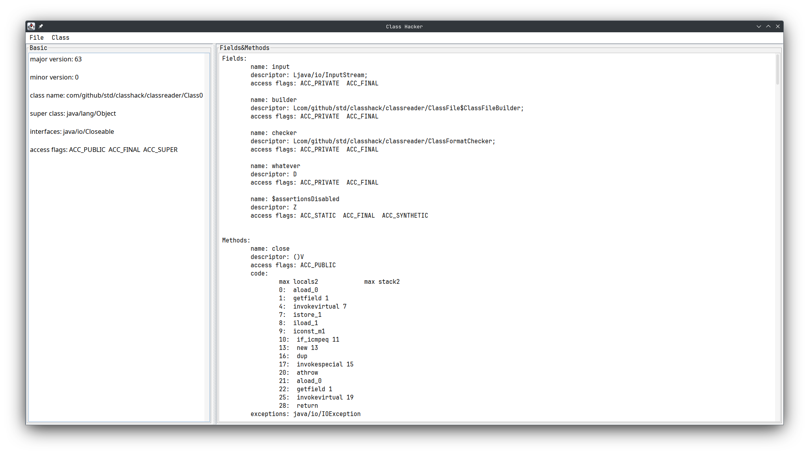

# ClassHack

A JVM(Java 8) class file parser

# Usage

java -jar ClassHack-<version>.jar

JRE version should be at least 19

# Screenshot

</img>

</img>

</img>

# References

<a hr="https://docs.oracle.com/javase/specs/jvms/se8/html/">The Java® Virtual Machine Specification Java SE 8 Edition</a>
